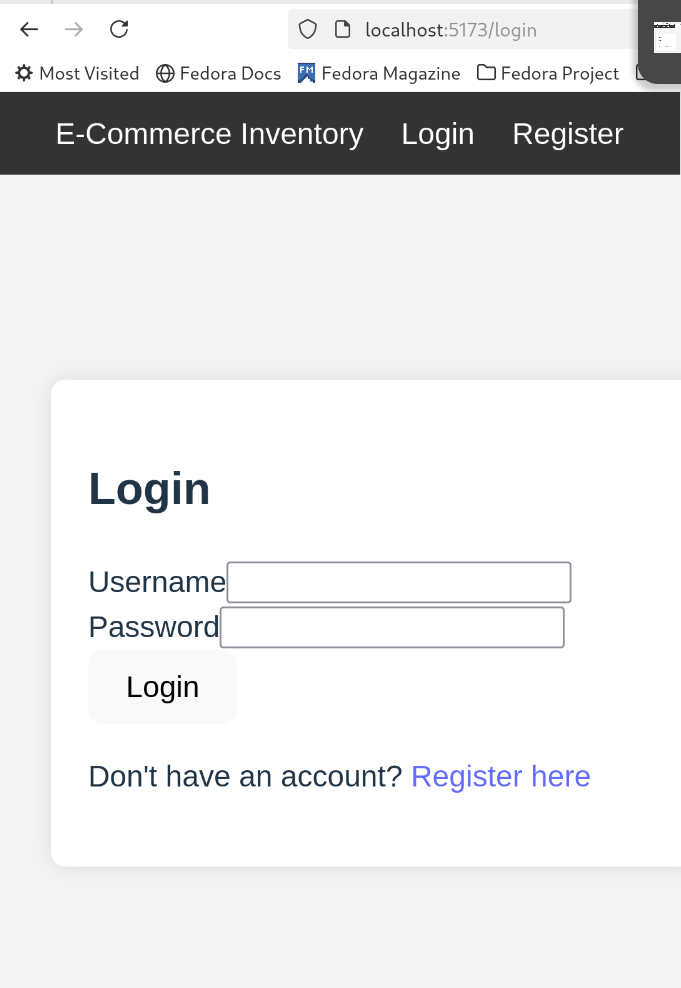
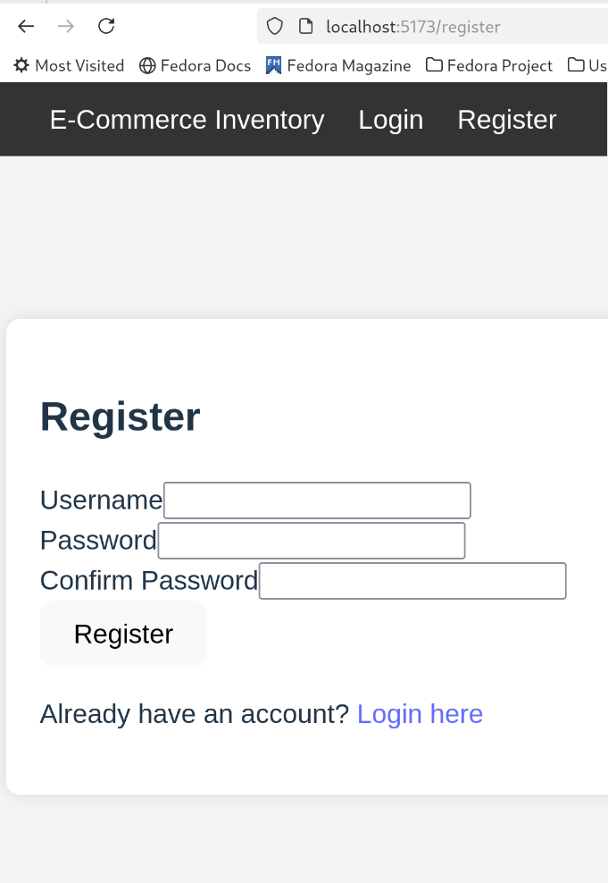
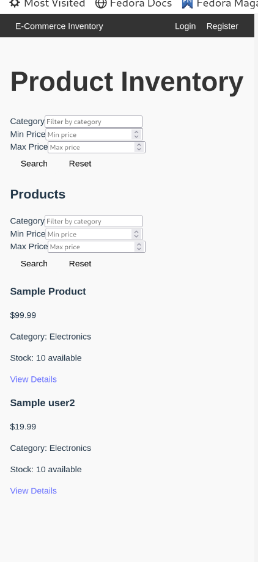

# React-Express-Inventory

# E-Commerce Product Inventory
## 🚀 Project Overview
This is a **full-stack** E-commerce Product Inventory system where different users can efficiently manage product listings.

### **Users**:
- **Admin**: Can manage all products (add, update, delete, list).
- **Sellers**: Can only manage their own products.
- **Visitors**: Can browse available products.
Home
## 🌟 Features
✅ **User Authentication** (Register/Login)  
✅ **Product Management** (CRUD operations)  
✅ **Search & Filter** Products by category or price  
✅ **Admin Panel** for full inventory control  
✅ **Seller Dashboard** to manage personal listings  
✅ **JWT-based authentication** for security  
✅ **Responsive UI** with React & Bootstrap  

## 📸 Screenshots
### 🔹 Login Page


### 🔹 Home Page (Product Listings)


### 🔹 Admin Panel


## 🛠️ Tech Stack
### **Frontend**
- React.js (Vite)
- React Router
- Tailwind CSS / Bootstrap

### **Backend**
- Node.js & Express.js
- PostgreSQL (Database)
- JSON Web Token (JWT) for Authentication

## 📦 Project Structure
```
backend/
├── config/
├── controllers/
├── middleware/
├── models/
├── routes/
├── server.js
frontend/
├── public/
├── src/
│   ├── components/
│   ├── pages/
│   ├── services/
│   ├── context/
│   ├── App.jsx
│   ├── index.jsx
│   ├── styles/
```

## 🏗️ Installation & Setup

### **1️⃣ Clone the Repository**
```sh
git clone "https://github.com/khizerhaider/React-Express-Inventory.git"
cd React-Express-Inventory
```

### **2️⃣ Setup Backend**
```sh
cd backend
npm install
cp .env.example .env  # Configure database & JWT_SECRET
node server.js  # Start the backend server
```

### **3️⃣ Setup Frontend**
```sh
cd frontend
npm install
npm run dev  # Start the frontend
```

## 🚀 API Endpoints
### **Auth Routes**
| Method | Endpoint         | Description          |
|--------|----------------|----------------------|
| POST   | `/api/auth/register` | Register a new user |
| POST   | `/api/auth/login`    | Login user |

### **Product Routes**
| Method | Endpoint         | Description          |
|--------|----------------|----------------------|
| GET   | `/api/products`      | Get all products |
| POST  | `/api/products`      | Add a product (Admin/Seller) |
| PUT   | `/api/products/:id`  | Update product |
| DELETE| `/api/products/:id`  | Delete product |

## ✨ Contributors
- **[Khizer]([https://github.com/khizerhaider](Khizer))** - Developer

## 📜 License
This project is licensed under the MIT License - see the [LICENSE](LICENSE) file for details.

---

💡 **Need Help?** Open an issue or reach out on GitHub! 🚀

